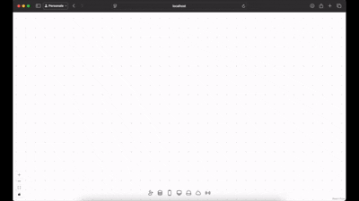

# 📌 Diagrams

A canvas to draw very simple diagrams with local storage type of persistance.

> ℹ️ I made this project in 2023 to play with React Flow and Zustand.

## 🚀 Functionalities

- Add icons from the palette;
- Add a custom label to icons;
- Add links to connect icons.
- Customize and/or add icons with a JSON file
- Your diagram is persisted in the local storage (you won't lose it if you refresh the page).

## How to change icons palette

Edit the file `app/mocks/kit.json`.
If you want to test the Gitflow version, rename:

- `kit.json`-> `whateveryouwant.json`
- `kit-gitflow.json`-> `kit.json`

Basically the code will import a file named `kit.json` inside `app/mocks` folder.

## 📦 Installation

Make sure to have NodeJS installed in your system.

```bash
git clone https://github.com/mattveraldi/diagrams.git
cd diagrams
npm install
```

## 🛠 Framework and libraries

- Remix Run (React): the full stack framework;
- React Flow: library to create graph;
- Zustand: state management.

## ️🎥 Demo


